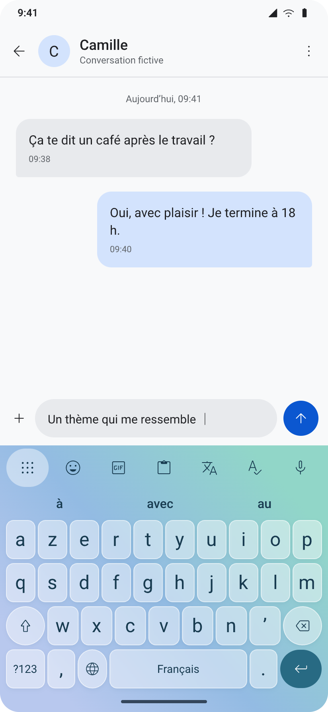
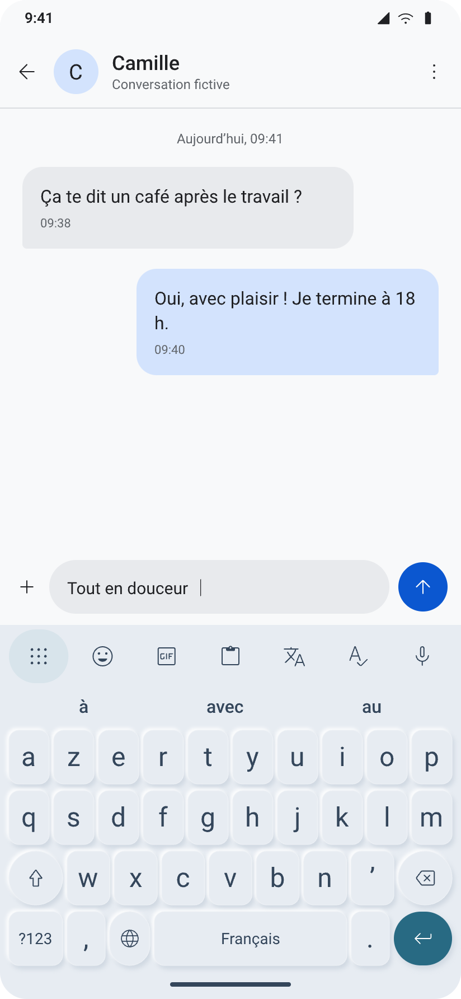
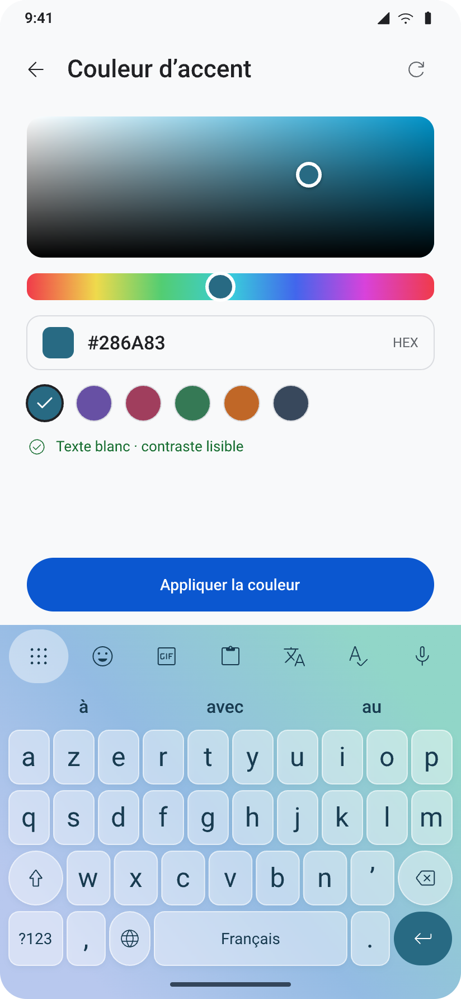

# Clavier Android

Clavier Android inspiré des repères de Gboard, avec traduction ML Kit, dictée Whisper, émojis, GIF Tenor et thèmes personnalisables.

**Première version alpha native, Android 8.0+ (ARM64 et x86_64).** [Télécharger la release](https://github.com/azksama/clavier-android/releases/tag/v0.1.0-alpha.1). Cette version compile et passe ses contrôles sur poste ; elle n'a pas encore été testée sur téléphone ou émulateur. Les images ci-dessous sont des maquettes.

## Maquettes

Les 30 écrans sont disponibles dans [la galerie](design/SCREENS.md), avec les PNG et le document pen.dev éditable. Les conversations sont fictives et les vignettes GIF sont des illustrations statiques, pas des résultats Tenor.

| Verre | Relief | Couleurs |
| --- | --- | --- |
|  |  |  |

## Choix confirmés

- Traduction sur le téléphone avec Google ML Kit, après téléchargement des langues.
- Dictée des messages avec Whisper.
- Thèmes classique, verre et néomorphique ; personnalisation du fond, des touches, du texte et de l'accent.
- Presse-papier et émojis. GIF Tenor sous réserve d'une clé existante : Tenor n'accepte plus de nouveaux clients API depuis janvier 2026.
- Correction locale facultative avec Gemini Nano / AICore, selon compatibilité de l'appareil. Une sélection courte est relue avant remplacement.
- Gestionnaires de mots de passe via Android Autofill : suggestions intégrées dès Android 11 avec les fournisseurs compatibles, menu système autrement. Compatibilité par gestionnaire encore à tester.
- Aucun compte ni abonnement OpenAI nécessaire pour ces fonctions. Pas de connexion ChatGPT intégrée.

Voir [les décisions produit](PRODUCT.md), [la direction visuelle](DESIGN.md) et [les limites de la maquette](design/README.md).

## Installation

1. Télécharger l'APK signé depuis la release et l'installer sur un appareil ARM64 Android 8+ (ou émulateur x86_64).
2. Ouvrir **Clavier**, toucher **Activer Clavier**, puis **Choisir Clavier**. Android affiche l'avertissement habituel des claviers système.
3. Choisir son thème et tester la saisie dans le champ de l'application.
4. Télécharger les langues ML Kit pour traduire. Pour dicter, télécharger Whisper Tiny (78 Mo) et autoriser le microphone. La transcription reste sur le téléphone.
5. Pour la correction, vérifier la compatibilité AICore dans les réglages. Pour les GIF, enregistrer une clé Tenor existante. Ces deux fonctions peuvent être indisponibles selon le matériel ou les accès fournisseur.

Les modèles sont téléchargés séparément de l'APK. Le presse-papier est facultatif, chiffré, limité à 20 extraits et à une heure sauf épinglage. Un appui long sur une lettre affiche ses accents, sur Majuscule verrouille les capitales et sur le globe ouvre le sélecteur Android.

L'alpha ne propose pas encore le glissement, un mode une main ou une prédiction comparable à Gboard. Les tests et les scénarios restant à vérifier sont détaillés dans [VALIDATION.md](VALIDATION.md). [Confidentialité](PRIVACY.md) · [Licences](THIRD_PARTY_NOTICES.md).

## Construire

Prérequis : Git, Python 3.10+, JDK 17, Android SDK plateforme 36 et NDK 29.0.14206865. Les dépendances Java/Kotlin sont résolues par Gradle ; Whisper est figé à un commit.

```sh
python scripts/bootstrap.py
python -m venv .build-tools
# Windows : .build-tools/Scripts ; Linux/macOS : .build-tools/bin
.build-tools/bin/pip install cmake==3.31.6 ninja==1.11.1.3
.build-tools/bin/python scripts/configure_cmake.py
./gradlew :app:assembleDebug :app:testDebugUnitTest :app:lintDebug
```

Sous Windows, utiliser `gradlew.bat` et les chemins `Scripts` du venv. Définir `ANDROID_HOME` ou `sdk.dir` dans `local.properties` (les deux-points d'un chemin Windows doivent être échappés : `C\:/...`). Le SDK doit contenir les licences Android acceptées. `configure_cmake.py` modifie uniquement `cmake.dir` et associe le Ninja du venv à CMake.

APK de développement : `app/build/outputs/apk/debug/app-debug.apk`. La [CI](.github/workflows/android.yml) construit les deux architectures et conserve l'APK debug ainsi que les rapports. La signature de distribution reste privée et n'est pas incluse dans la CI ou les sources ; voir [RELEASING.md](RELEASING.md).
